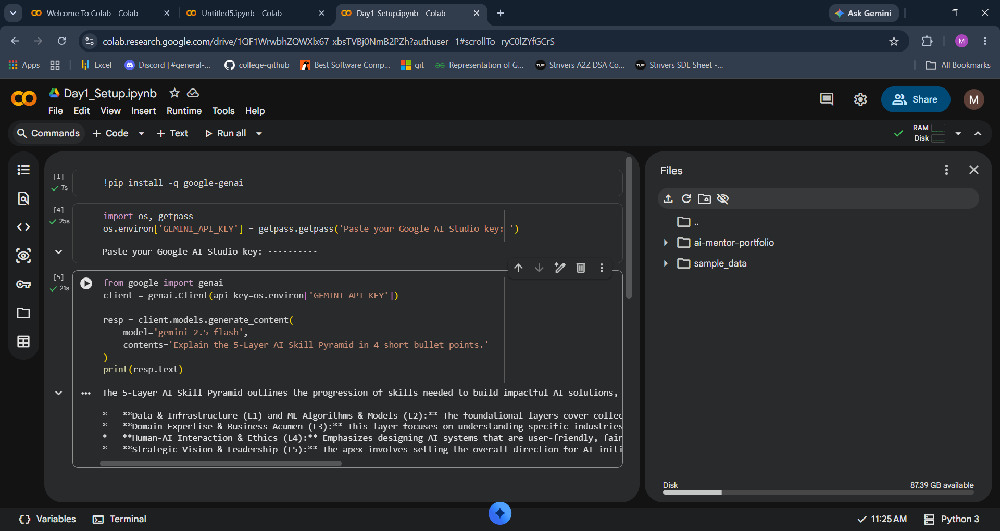
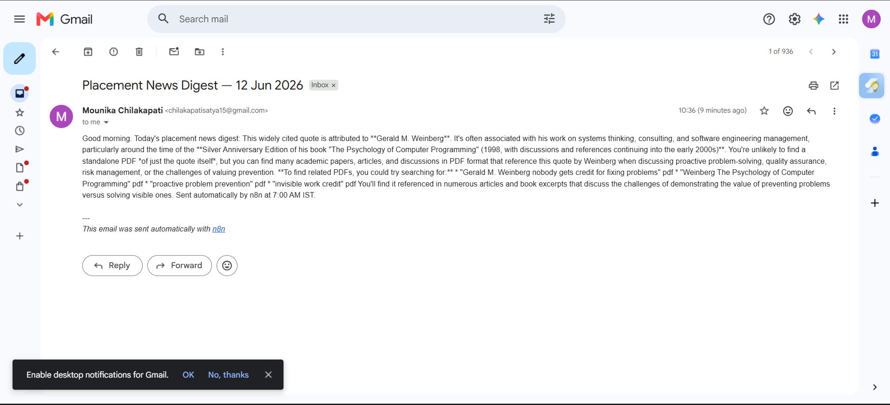

# ai-mentor-portfolio


# AI Mentor Bootcamp — Chilakapati Mounika

Public portfolio of 12-day AI Trainer Workshop. By Day 12: 6 daily notebooks + capstone Streamlit URL.


## Day 1 — Setup complete

- ✅ Google AI Studio API key provisioned
- ✅ Groq API key provisioned
- ✅ Hello-Gemini call working — see [Day1_Setup.ipynb](Day1_Setup.ipynb)
- 4-tool comparison matrix from Lab 1A: see screenshot below




 ## Day 2 Lab 2B — Errors handled

1. **Markdown fence wrapping** (` ```json ... ``` `)  
   Gemini sometimes wraps JSON in markdown fences.  
   Retry logic forces raw JSON output, which fixes this in most cases.

2. **Missing phone number**  
   Some résumés do not include a phone number.  
   Using `Optional[str] = None` allows Pydantic to accept `null` instead of failing validation.

3. **Empty or whitespace-only input**  
   When input text is empty, Gemini cannot extract required fields.  
   Pydantic raises a `ValidationError`, which is caught and handled gracefully by the caller.

## Sample résumés processed: 3 / 3 successful

## Day 4 — n8n Daily News Digest

- ✅ Self-hosted n8n via Docker
- ✅ Workflow: Schedule (7AM IST) → RSS → Gemini summariser → Gmail
- ✅ Workflow JSON committed: [Day4_NewsDigest.json](Day4_NewsDigest.json)
- ✅ Test email screenshot below




## Day 5 — Résumé Scorer Streamlit

**Live URL:** https://ai-mentor-portfolio-zbzcl37ggwegwqxw6dpmrc.streamlit.app/
**Code:** [app.py](app.py)
**Acceptance log:** [acceptance_log.md](acceptance_log.md)
**Tools used:** Continue.dev + Gemini 2.5 Flash + Streamlit Community Cloud

### Features
- Fit score with rationale
- 4-axis bar chart breakdown
- Missing skills + free learning resources

### Reflection (3 lines)
- **Vibe vs engineered:** This is vibe-coded. To productionise, I would add caching, error handling on Gemini failures, rate limiting per user.
- **What Continue.dev did well:** scaffolded the Streamlit layout fast.
- **What I had to fix:** Continue.dev forgot to add the 4 sub-score fields to the Gemini prompt itself; I had to add them.


## Day 5 Lab 5B — Hugging Face Pulls

### Models tested
- `facebook/bart-large-mnli` — zero-shot classification
- `distilbert-base-uncased-finetuned-sst-2-english` — sentiment

### Timing comparison

| | min | avg | Notes |
|---|-----|-----|-------|
| HF Inference API | 10.06s | 10.08s | Cold-start: 20s |
| Local in Colab | 0.74s | 1.58s | Download: 60s on first run |

### When to use each (3-line reflection)

1. **API:** for low-volume, occasional calls. Avoids download. Cold-start risk on first call after idle.
2. **Local:** for batch processing 100+ items, where you want predictable latency and don't pay per call.
3. **Production rule of thumb:** if your usage exceeds the API free tier (~30K requests/month at HF), self-host. Otherwise API.
